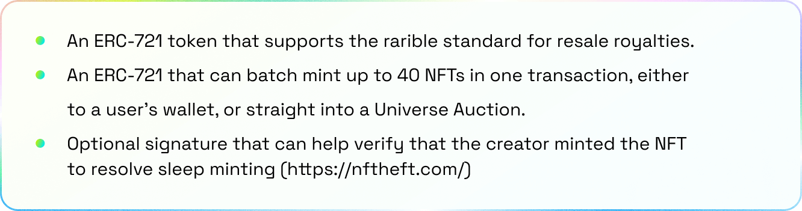
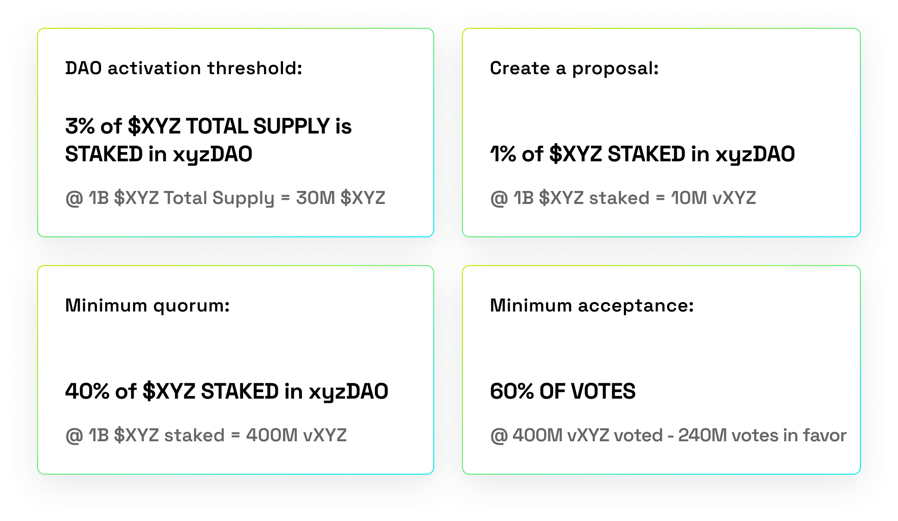
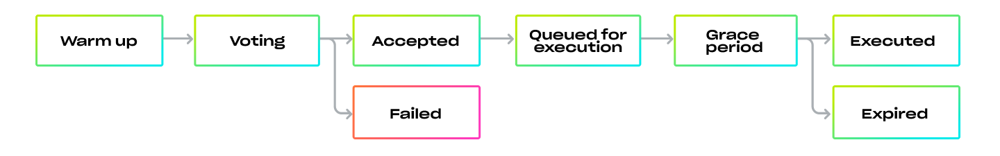
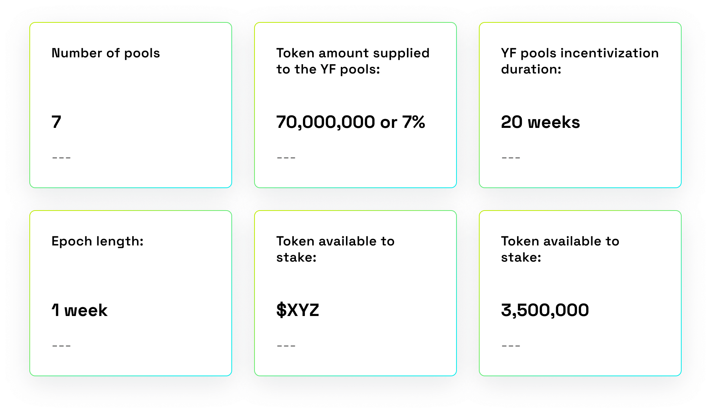
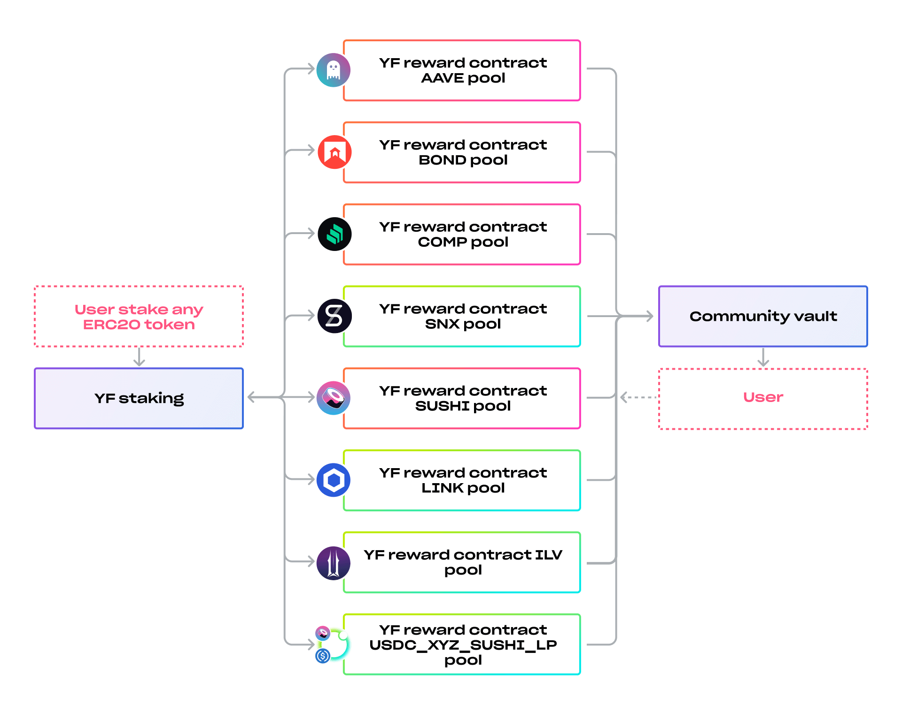
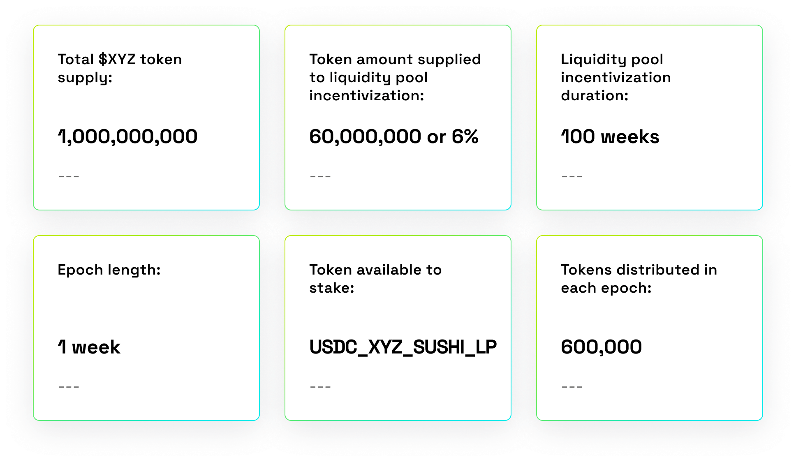
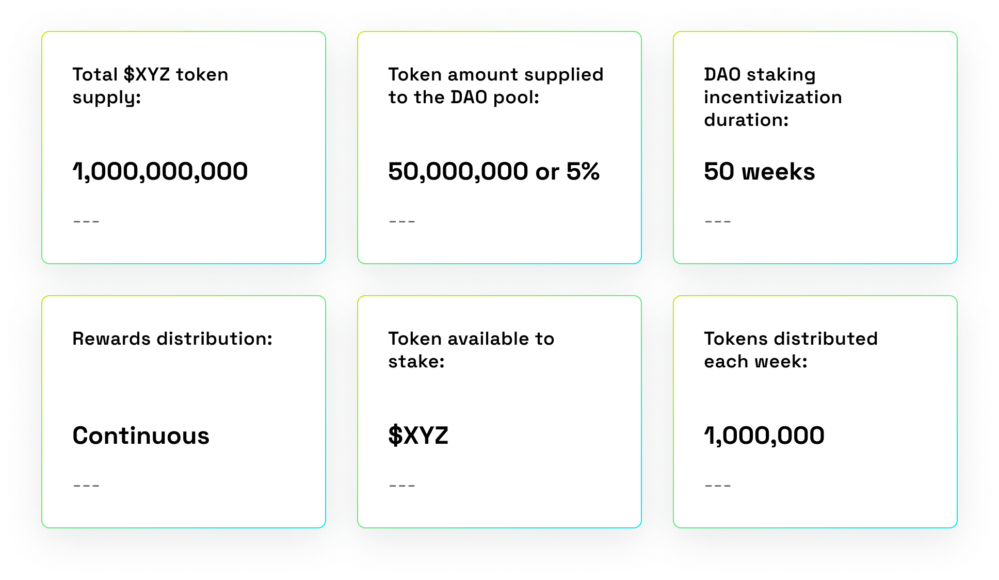
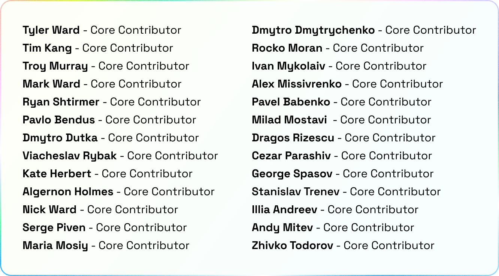
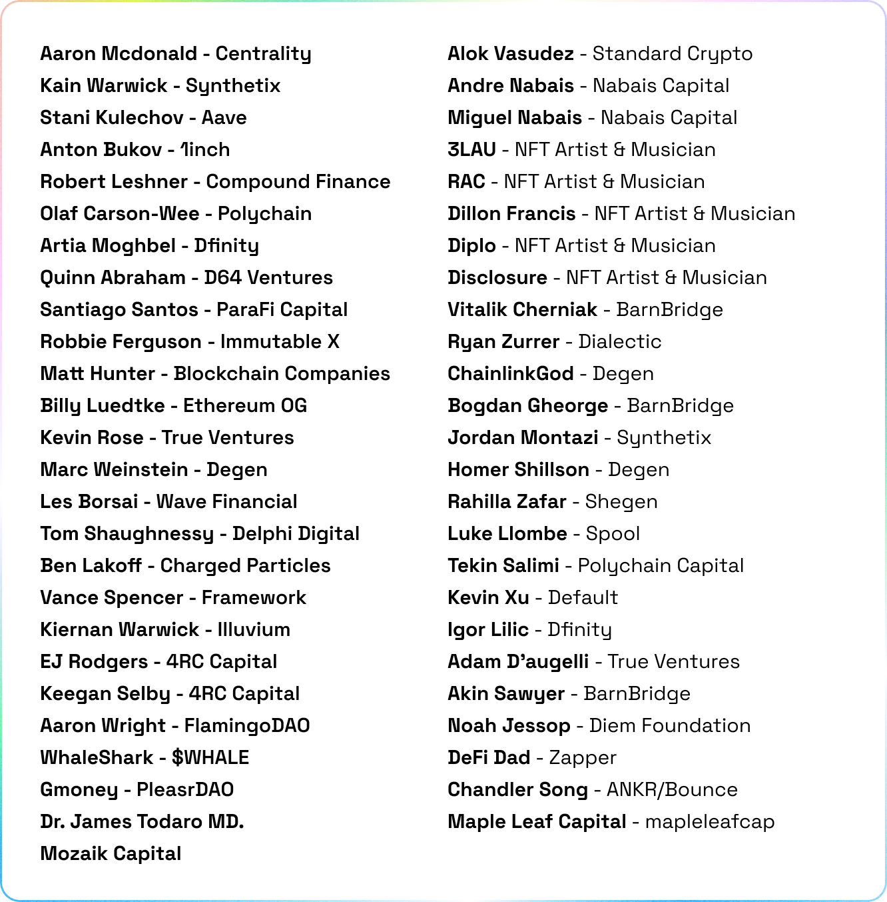

# **Universe Protocol**

#### ***META: To provide a system that doesn’t live off the backs of artists and creates a protocol for sustainable ecosystems for artists and fans alike.***

Creative cosmic dust exists all around us, the unifying force of XYZ is what governs the creative cosmic dust. XYZ in their wisdom brings order to the Universe through governance of a Decentralized Autonomous Organization. The Universe Protocol.

Initially there are two main functions of the Universe Protocol: the first is a novel method for creating new Collections, and the second is auctioning off those Collections.  The xyzDAO governs the parameters of the Universe Protocol functions.

The Universe Protocol allows you to launch your own community-driven content backed by social tools, media services, and content distribution as well as tokens, games, and finance. 

The Universe Protocol is a community bootstrapping engine. It's designed to embed community building mechanics into the way you mint and monetize NFTs. You can transform NFTs from standalone objects to a Franchise of Collections.

## Universe Minting

In the Universe, an NFT is minted for each item in a Collection.  Each collection of art can include a variety of digital formats including video formats, music, and more.  Collections can also hold sub-collections in them.  This allows for the creation of additional NFTs such as layers of art, shows, merchandise, music. etc. that can evolve over time under one umbrella community structure.

In this way the Universe Protocol allows content to grow over time with community input, yet retaining programmatic links back to its origins and creators.

In future build outs, we aim to enable the ability to turn collections into mini DAOs along with an integrated social network.

## Custom ERC-721 Universe token

To create an optimal minting experience, Universe’s NFTs are both ERC721-compatible, and include a variety of upgrades to allow seamless integration with the Universe Auction House and provides artists the ability to collect resale royalties across not only Universe’s auction platform, but on a variety of secondary markets, including Rarible. 

## Universe auction

We are developing a trustless decentralized auction house for NFTs. You can use existing NFTs or mint new collections and create a multi-tier auction with multiple winners. For example, there can be ten winners of an auction starting from the highest bidder, and each winner can even receive multiple NFTs as the prize. The auction can specify the ERC-20 currency used to bid with, and can optionally set a reserve price for a specific tier. At its simplest, you can set up a single tier, reserve price English auction that is well known. There will be ZERO FEES for initial auctions, with all revenue going to the creator - we are here to empower artists at our core. However, the xyzDAO will take a 2% fee on every resale on the Universe platform to support continued innovation.

## Creator royalties

Along with xyzDAO resale fees, Universe will allow creators to specify a percentage royalty fee for every secondary market sale. For example if a creator has declared a 5% royalty and a 10 ETH sale occurs, the seller will incur a 0.5 ETH fee paid to the creator and a 0.1 ETH fee paid to xyzDAO (1%), and the seller will receive 9.4 ETH after fees.

xyzDAO will only ever take a fee from secondary sales and never take money from Artists on the initial drop, outside of minting fees, thus being the only platform to give 100% to Artists on the original release of the NFTs.

## Core collection drops

The initial Core Collection will be released to showcase the ease of use for aspiring artists to build and release their own NFT franchise using the features of the Universe Protocol. The Core Collection provides an example for aspiring artists for how to build out your franchise using the features of the Universe Protocol.

Utilizing grants, xyzDAO will incentivize designers, artists, project managers, and lore creators to develop Core Collections.  In the long term, character designers, lore creators & project managers will function in a role similar to keepers in defi or cron jobs in programming.

All xyzDAO Core Collection content will be issued and released with their IP under the Creative Commons license.  This allows anyone to build on top of the content, to make other collections, but does not allow anyone to change the base collection and lore.

These Core Collections are rare and will exist as a framework to demonstrate how to launch and release your own collection with a solid foundation & show new artists how to build successful communities around the art inside of their collection.

### First collection drop

The first Core Collection is a series of original NFTs that represent the base characters, lore comics, and images of these characters in various formats. Base characters are auctioned & their lore comics & media files are distributed on a bonding curve as unique media.  Reprints of the base character, lore comics, and images are distributed on a bonding curve as well. 

The first Core Collection drop, by xyzDAO on the Universe Protocol, contains 69 OG characters.  The drop will include originals and prints priced on a “Universe curve,” a bonding curve that’s designed to last the lifetime of the Universe.

Everything needed to re-create and evolve each Core Collection masterpiece is stored on-chain on decentralized and trustless networks. 

The NFT holder of each Core Collection base character receives 6% of the ongoing fee for all bonding curve activity and the rest goes to the xyzDAO. Lore print holders will receive 4% of reprints, base character holders receive 2% of reprints. Rare image holders will receive 4% of reprints, base character holders receive 2% of reprints.

### Value rollup

## xyzDAO

This new DAO describes the team’s collective thinking around how governance works at scale on Blockchains. We pulled from the two governance models that are working at scale, i.e. Bitcoin and Ethereum, and pushed most governance off-chain. We tried to streamline the online voting part and make it an elegant process so it is accessible to an inexperienced governance participant or the professional alike.

xyzDAO will have control over the parameters of the Universe Protocol, more specifically the fees and future upgrades to the Universe. The parameters of creating new Collections and turning off the $XYZ token mint function will also be under the control of the xyzDAO.

The xyzDAO is a direct fork of the BarnBridge DAO, which was audited by Quantstamp and Haechi.

### DAO Thresholds

### Proposal states

## xyzToken

The initial $XYZ supply will be 1,000,000 $XYZ.

A total of 69,777 $XYZ will be minted during a calendar year in order to re-calibrate the treasury and ensure long term contributors can be a part of the project.  Inflation will kick in 1 calendar year after the xyzDAO is launched. 

**Stopping this mint function and/or editing this mint function** will be controlled by the xyzDAO.

### Supply

A stream of $XYZ tokens will be released annually. These tokens are distributed to team, contributors, and the community.

### Token economics

$XYZ is a governance token that powers Universe.xyz. $XYZ has no other function.

### Yield farming

$XYZ will be farmable with AAVE, BOND, COMP, LINK, SNX, SUSHI and ILV.

### Yield farming distribution

## $XYZ ERC-20 token

### Liquidity pool incentivization

### DAO Distribution

## Future development

Any and all future developments will need legal review before we launch them.  This includes core universe drops as well as additional scope to the project to ensure it complies with international legal requirements. 

With the advent of improvements in decentralized infrastructure we look forward to using this exciting new frontier to expand the Universe Protocol to include new features that all content creators and fans can enjoy if xyzDAO wills it. 

We are actively looking into decentralizing the entire technology stack from the smart contracts to the user interface.  We see a lot of exciting possibilities in the future and look forward to being at the forefront of what is coming.  A major contention inside the NFT world is that they aren’t really decentralized and you need to trust where you stored the media. This is something that we are also doing a lot of research around.

We see a wide range of technologies and networks being able to integrate to the community building functions in the Universe Protocol. Some of the things we are looking at are:

### Universe social:

- The central communication hub of Universe.XYZ
- A rule driven ecosystem of communities.
- Reddit/tumblr-like forum with each character lore and galaxies existing as a sub
- Messaging 
- Digital Identity linked to specific NFT(s)
- Customizable Galleries and Slideshows

### Universe dapp integration:

- Art / NFTs - showcases/collections and avatars with proof of ownership identification (NFT version of blue checkmarks) 
- Forums for lore building universe.xyz’s NFTs (see Art/Media)
- Gaming - On platform web based decentralized games, some of which may leverage specific collections of NFTs
- Third party network Dapp integration

### Universe gaming:

- Games built with web 3.0 at their forefront, not added in as an afterthought
- **Polymorphic Universe V2** - Our first signature game on the platform. Members of the community will also be able to create new and different games as an extension to the universe
- This is a bootstrap game and one initial model but others will be able to create gaming functionality which can integrate into the Universe Protocol

## Summary

Universe is a collection of everything an artist or a collector would need in one place. As the space grows so will we, we will persistently stay on top of evolving technology in the NFTs space. As the NFT Universe expands and grows there will be more opportunities for the governance and DAO to propose new routes and let a community guide the protocol. This will help artists and the protocol build tools for everyone to use as long as it complies with current laws. Universe was built by artists for artists to allow anyone to bring their own universe alive. Now with decentralized technology Artists and the community can steer this project where they would like it to go.

## Contributors

